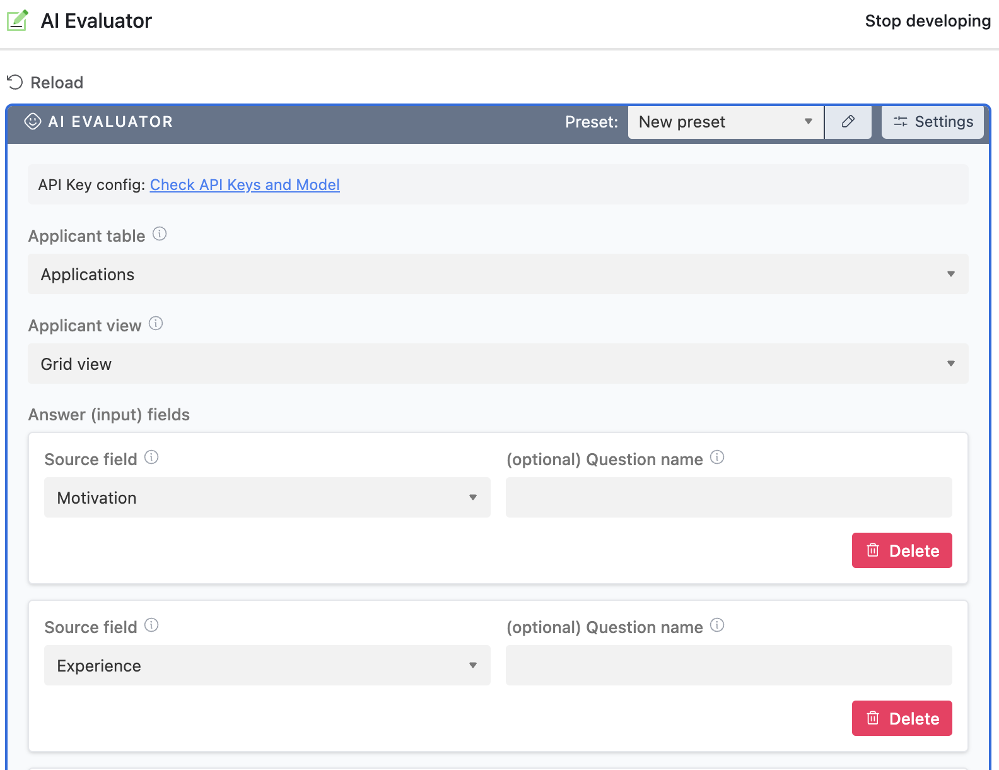

# ai-evaluator-extension 

[Airtable extension](https://airtable.com/developers/extensions/guides/getting-started) for helping us evaluate applications to our courses using large language models (LLMs).

## Context

We previously manually evaluated each applicant for our educational courses on a set of objective criteria. We would then use these scores plus some additional subjective judgement to come to an application decision. This is time-intensive, and it's difficult to align all the humans to give the same responses for the same person.

In a [previous pilot project](https://github.com/bluedotimpact/ai-application-evaluations-pilot) we concluded that LLMs, while not perfect, could help us automate the first scoring part of our application process.

This repository holds code for an Airtable extension that we can run inside our applications base. We set the relevant inputs (e.g. answers to application questions), the decisioning criteria, and let it evaluate applicants.

## Developer setup

> [Video tutorial](https://www.youtube.com/watch?v=nhnPxvEZmLk)

To start developing this extension:

1. Clone this git repository
2. Install [Node.js](https://nodejs.org/)
3. Install [Bun](https://bun.sh/) with `curl -fsSL https://bun.sh/install | bash`
4. Run `bun install`
5. Configure API keys and models:
   - Edit `lib/env.ts` with your API keys for OpenAI and/or Anthropic
   - Configure the desired model in `lib/getChatCompletion/openai/config.ts` and/or `lib/getChatCompletion/anthropic/config.ts`
   - Set your OpenAI organization ID if applicable
6. Run `bun run start` (for the 'Applications' base in the BlueDot Impact AirTable account)
7. Load the relevant base
8. Make changes to the code and see them reflected in the app!

If the changes don't appear to be updating the app, try clicking the extension name then 'Edit extension', then pasting in the server address printed to the console from step 6 (probably `https://localhost:9000`).

Changes merged into the default branch will automatically be deployed. You can manually deploy new versions using `bun run deploy`. If you get the error `airtableApiBlockNotFound`, set up the block CLI with `npx block set-api-key` with a [personal access token](https://airtable.com/developers/web/guides/personal-access-tokens).

If you want to install this on a new base see [these instructions](https://www.airtable.com/developers/apps/guides/run-in-multiple-bases).
